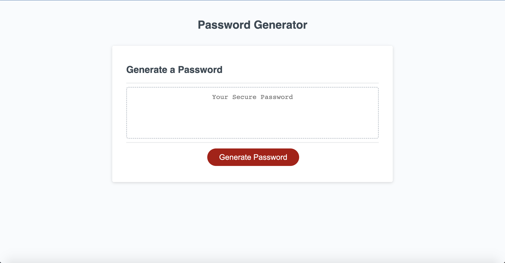

# Password Generator

## What this Project does

This refactor focused on adding all the required JavaScript to run the Password Generator.

## What can the [Password Generator](https://jeevanmkj.github.io/password_generator/) do?

A user can generate a random passowrd containing anywhere between 8 and 128 characters.
Further, the user can decide to include:

- uppercase laters
- lowercase letters
- numbers
- special characters

